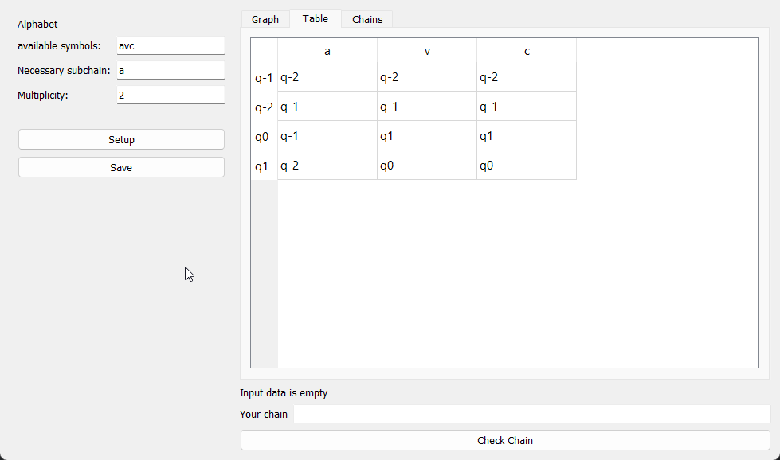

## Installation
```console
git clone https://github.com/Teyrro/dka_generator
cd dka_generator
python -m venv .venv
.\.venv\Scripts\activate
pip install pipenv
pipenv install
python .\Widgets\MainWindow.py
```


## Example



